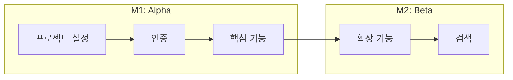
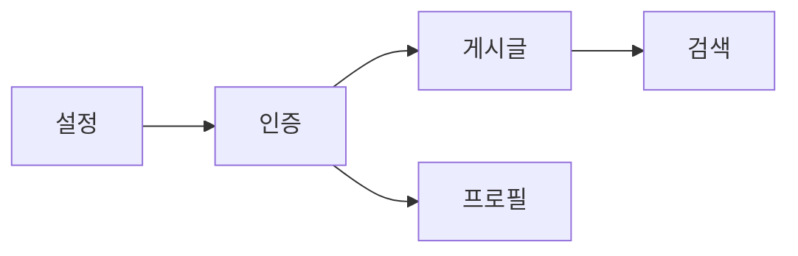

# MVP Roadmap Generator

개발 순서와 일정을 정의하는 MVP Roadmap 문서 생성 가이드.

## 워크플로우

```
1. 인터뷰 → 2. 복잡도 추정 → 3. 의존성 분석 → 4. 문서 생성 → 5. 검토/보완
```

## 레퍼런스 파일

| 파일 | 용도 | 언제 참조 |
|------|------|----------|
| `references/complexity-guide.md` | 기능 타입별 복잡도/소요시간 기준 | 복잡도 추정 시 |
| `references/mermaid-templates.md` | 의존성 다이어그램 템플릿 | 의존성 시각화 시 |

## 복잡도 기준 요약

| 복잡도 | 프론트 | 백엔드 | 풀스택 |
|--------|--------|--------|--------|
| **S** | 1일 | 1일 | 2일 |
| **M** | 2-3일 | 2-3일 | 4-5일 |
| **L** | 1주 | 1주 | 1.5-2주 |
| **XL** | 2주+ | 2주+ | 3주+ |

상세 기준은 `references/complexity-guide.md` 참조.

## 인터뷰 질문

순차적으로 질문하여 정보 수집. 한 번에 2-3개씩 질문.

### 필수 질문

**일정**
- "출시 목표 일정은?"
- "개발 리소스는? (인원/시간)"

**우선순위**
- "가장 먼저 출시하고 싶은 기능은?"
- "꼭 1차에 들어가야 하는 기능 vs 나중에 해도 되는 기능?"

**리스크**
- "예상되는 기술적 도전은?"
- "외부 의존성이 있나요? (API, 결제 등)"

### 선택 질문 (필요시)

- "스프린트 주기는? (1주/2주)"
- "QA 프로세스가 있나요?"
- "배포 주기는?"

## MVP Roadmap 템플릿

```markdown
# MVP Roadmap: [서비스명]

## 1. 프로젝트 개요

- **출시 목표**: YYYY-MM-DD
- **개발 인원**: N명
- **스프린트 주기**: 2주

## 2. 마일스톤 정의

| ID | 이름 | 기간 | 목표 | 성공 기준 |
|----|------|------|------|----------|
| M1 | Alpha | 4-6주 | 핵심 기능 동작 | 주요 플로우 완성 |
| M2 | Beta | 4-6주 | 테스트 가능 | 전체 기능 완성 |
| M3 | Release | 2-4주 | 출시 준비 | 버그 수정, 최적화 |

## 3. 의존성 다이어그램



## 4. 기능 분해 (Feature Breakdown)

### F001: 회원가입/로그인
- **마일스톤**: M1
- **우선순위**: P0
- **복잡도**: M
- **예상 소요**: 4일

| ID | 태스크 | 타입 | 시간 | 의존성 |
|----|--------|------|------|--------|
| F001-1 | 회원가입 API | backend | 1일 | T001 |
| F001-2 | 로그인 API | backend | 0.5일 | F001-1 |
| F001-3 | 회원가입 UI | frontend | 1일 | F001-1 |
| F001-4 | 로그인 UI | frontend | 0.5일 | F001-2 |
| F001-5 | 인증 상태관리 | frontend | 1일 | F001-4 |

**수용 기준**:
- [ ] 이메일/비밀번호로 회원가입 가능
- [ ] 로그인 후 인증 상태 유지
- [ ] 유효성 검증 및 에러 처리

### F002: [기능명]
(동일 구조 반복)

## 5. 인프라 태스크

| ID | 이름 | 마일스톤 | 복잡도 | 소요 |
|----|------|---------|--------|------|
| T001 | 프로젝트 설정 | M1 | S | 1일 |
| T002 | CI/CD 구축 | M1 | M | 2일 |
| T003 | 모니터링 설정 | M3 | M | 2일 |

## 6. 스프린트 계획

### Sprint 1 (Week 1-2)
- **목표**: 프로젝트 설정 및 인증 시스템
- **용량**: 10일 (2명 × 5일)

| 태스크 | 담당 | 예상 | 상태 |
|--------|------|------|------|
| T001 | Dev1 | 1일 | |
| T002 | Dev1 | 2일 | |
| F001-1 | Dev2 | 1일 | |
| F001-2 | Dev2 | 0.5일 | |
| F001-3 | Dev1 | 1일 | |
| F001-4 | Dev1 | 0.5일 | |
| F001-5 | Dev2 | 1일 | |

**버퍼**: 2일 (20%)

### Sprint 2 (Week 3-4)
(동일 구조)

## 7. 외부 의존성

| 기능 | 의존 대상 | 타입 | 예상 소요 | Blocking |
|------|----------|------|----------|----------|
| F007 | Stripe 계약 | External | 1주 | Yes |
| F003 | 디자인 확정 | Internal | - | Soft |

## 8. 리스크 관리

| ID | 리스크 | 확률 | 영향 | 대응 방안 |
|----|--------|------|------|----------|
| R001 | PG 연동 지연 | Medium | High | 테스트 모드로 먼저 개발 |
| R002 | 요구사항 변경 | High | Medium | 버퍼 확보, 주간 싱크 |

## 9. 체크리스트 (기능별)

### 공통
- [ ] API 스펙 정의
- [ ] DB 스키마 설계
- [ ] 컴포넌트 구현
- [ ] API 연동
- [ ] 에러 핸들링
- [ ] 로딩 상태
- [ ] 테스트 작성
```

## 사용 예시

```
사용자: "로드맵 만들어줘"

Claude: MVP Roadmap을 작성하겠습니다. 먼저 몇 가지 질문을 드릴게요.

1. 출시 목표 일정은 언제인가요?
2. 개발 리소스는 어떻게 되나요? (인원/시간)
```

```
사용자: "3개월 내 출시 목표고, 풀타임 개발자 2명이야."

Claude: 좋습니다. 3개월 = 약 12주, 2명 기준으로 계획하겠습니다.
(references/complexity-guide.md 참조하여 용량 계산)

이어서 질문드릴게요.
1. 가장 먼저 출시하고 싶은 핵심 기능은 무엇인가요?
2. 외부 서비스 연동이 있나요? (결제, 소셜 로그인 등)
```

```
사용자: "PRD 있어. 이거 기반으로 로드맵 만들어줘"
[PRD 내용 첨부]

Claude: PRD를 분석하여 기능별 복잡도를 추정하겠습니다.
(references/complexity-guide.md 참조)

기능 목록:
1. 회원가입/로그인 - M (4일)
2. 게시글 CRUD - M (4일)
3. 검색/필터 - L (7일)
...

의존성 다이어그램을 생성하고 스프린트에 배치하겠습니다.
(references/mermaid-templates.md 참조)
```

```
사용자: "기능 간 의존성 시각화해줘"

Claude: Mermaid 다이어그램으로 의존성을 시각화하겠습니다.



복사해서 마크다운 문서에 붙여넣으면 렌더링됩니다.
```
