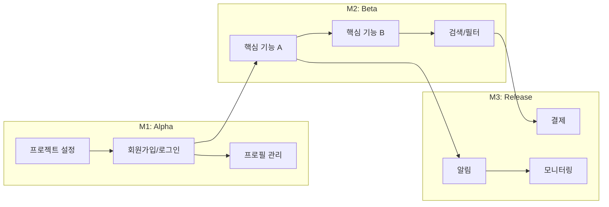
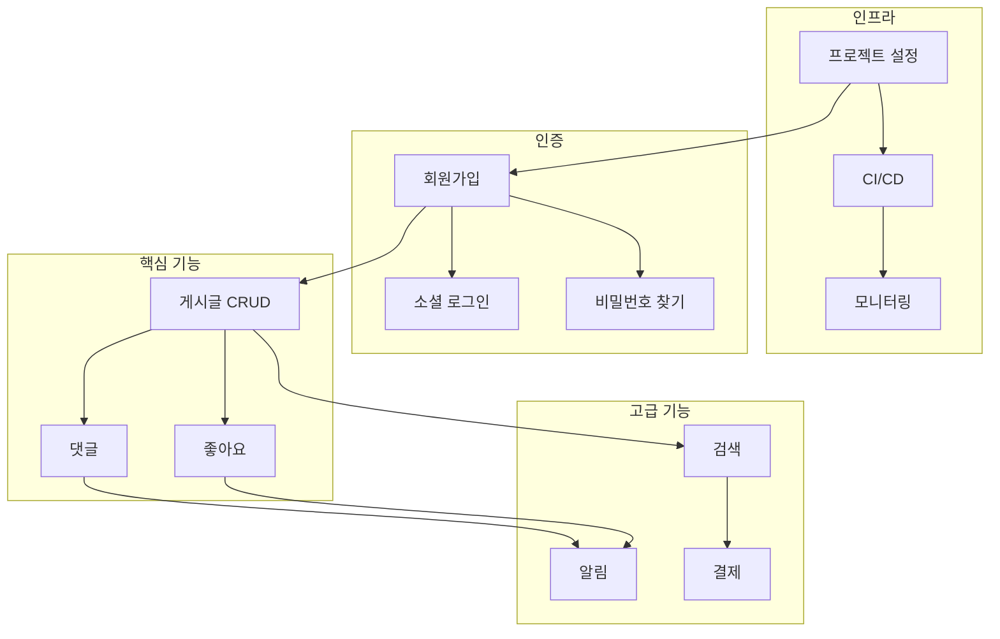
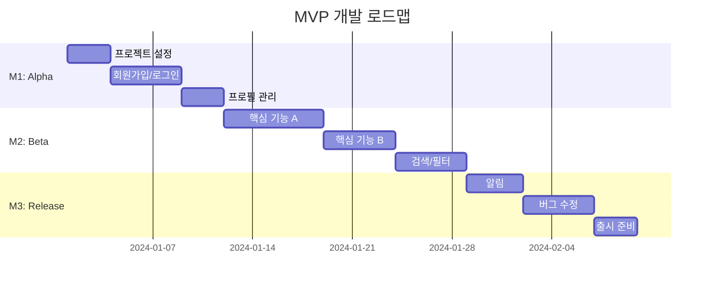
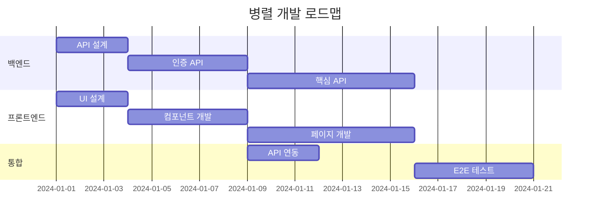
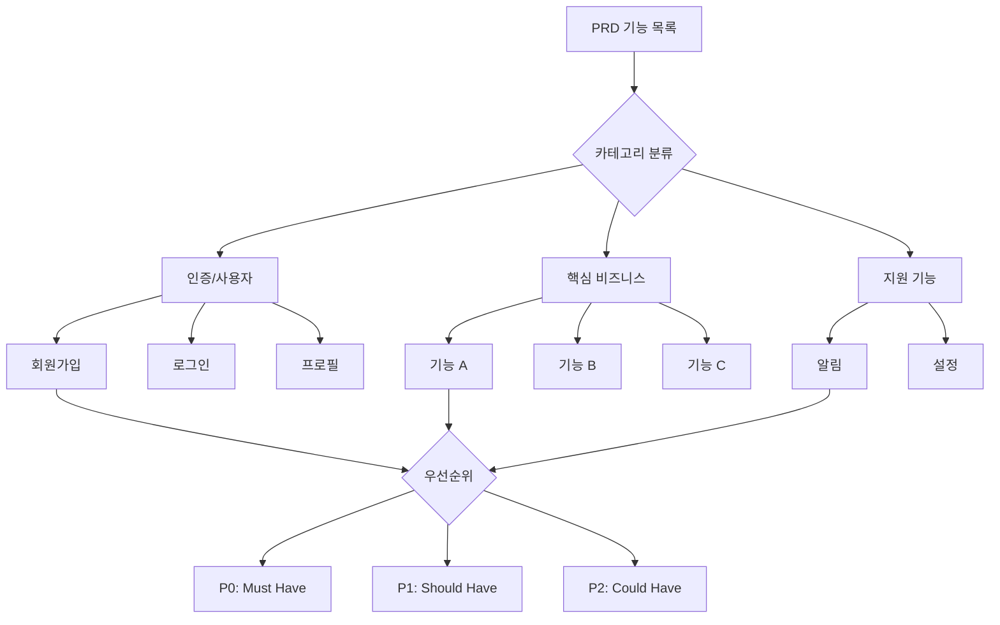
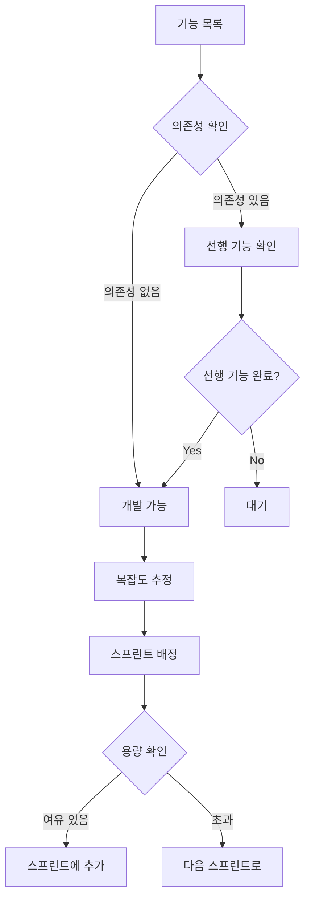
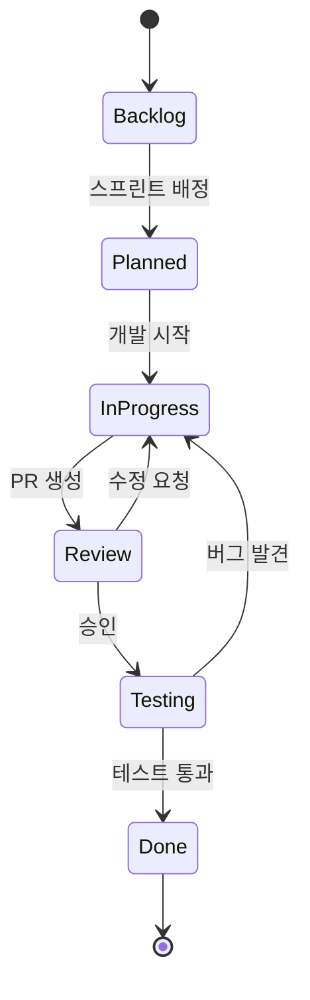
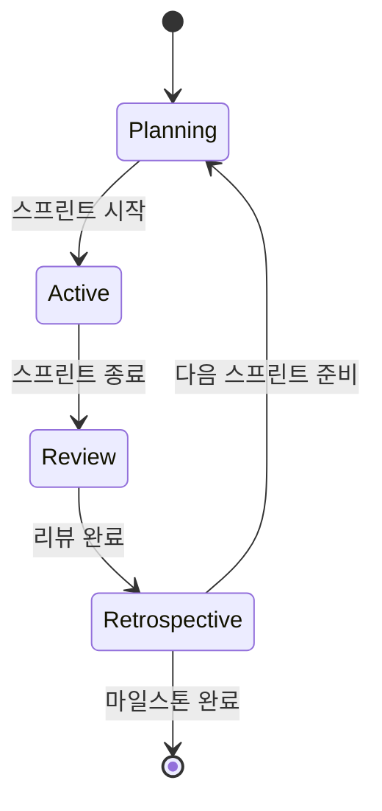

# Mermaid 다이어그램 템플릿

## 의존성 그래프 (Dependency Graph)

### 기본 템플릿

### 복잡한 의존성 템플릿

---

## 타임라인 (Gantt Chart)

### 스프린트 타임라인

### 병렬 작업 타임라인

---

## 플로우차트 (Flowchart)

### 기능 분해 플로우

### 스프린트 결정 플로우

---

## 상태 다이어그램 (State Diagram)

### 기능 개발 상태

### 스프린트 상태

---

## 사용 가이드

### 생성 방법

1. PRD의 기능 목록 확인
2. 의존성 관계 파악
3. 마일스톤별 그룹화
4. 템플릿 선택 및 커스터마이즈

### 다이어그램 타입 선택

| 목적 | 추천 다이어그램 |
|------|----------------|
| 기능 간 의존성 | graph (LR/TD) |
| 일정 계획 | gantt |
| 프로세스 흐름 | flowchart |
| 상태 변화 | stateDiagram |

### 마크다운에서 렌더링

대부분의 마크다운 뷰어에서 Mermaid 지원:
- GitHub
- GitLab
- Notion
- Obsidian
- VS Code (확장 프로그램)

지원하지 않는 경우:
- [Mermaid Live Editor](https://mermaid.live) 에서 이미지로 내보내기
